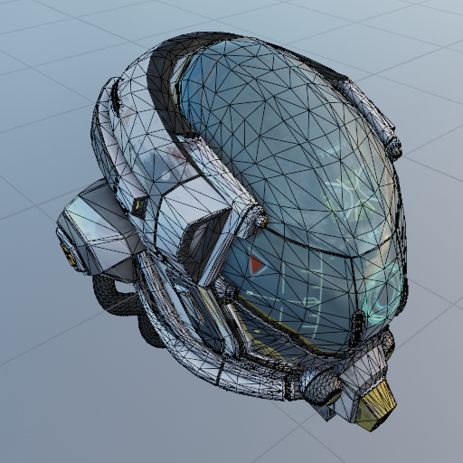
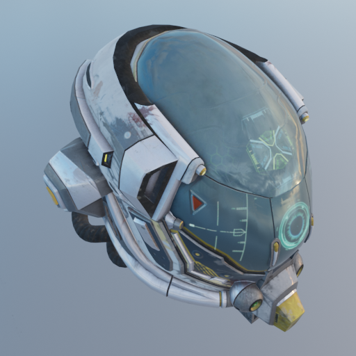
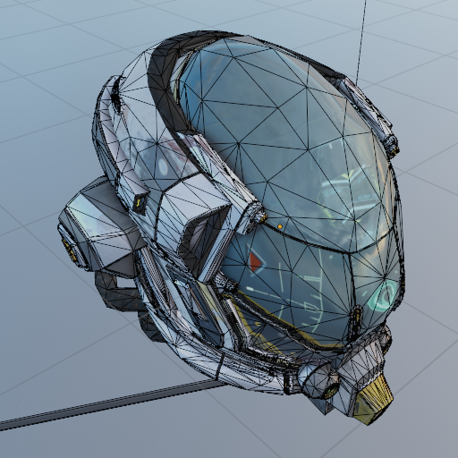
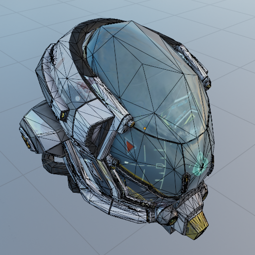
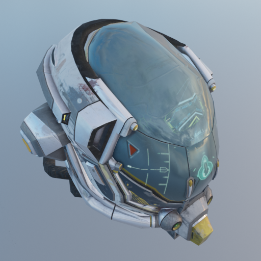
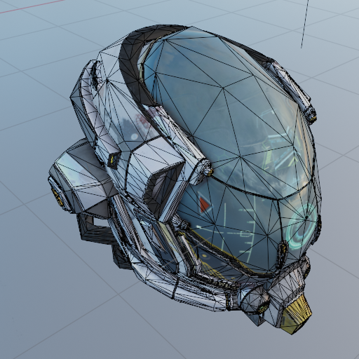
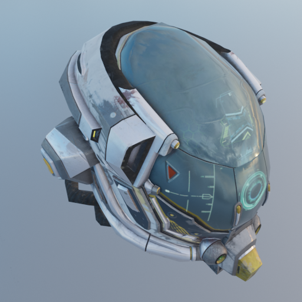

# GAMES106-HW5

GAMES 106 作业 5：网格简化

> Changelog:
> - 2023-08-03: 更新了 `debug-model/qem-test-fixed.obj`，该模型删去了 `qem-test.obj` 中的法线和纹理坐标信息，assimp 导入时则可以不拆分顶点，比较方便测试不支持分邻接顶点合并的简化算法。

## 作业简介

本次作业需要完成三个实验：

- **QEM 网格简化**
- **考虑顶点属性 (除 UV) 的网格简化**
- **考虑顶点属性 (含 UV) 的网格简化**

详细的作业要求请参考 [PDF](HW5_Readme.pdf).

本次作业提供的框架不依赖于 SaschaWillems/Vulkan 框架，可以独立编译运行。

框架本身使用 assimp 进行导入/导出，libigl 用于显示。

## 如何构建

本项目可以与仓库中其它代码一同构建，也可以单独构建。

单独构建可以参考如下的命令：

```shell
mkdir build
cd build
cmake ..
cmake --build ./
```

之后，运行 `GAMES106-HW5.exe` 并加载场景，一个示例界面如下：


## 作业提交

### 要求

1. 实现提到的三种网格简化算法
2. 提交报告，包含如下内容
   1. [DamagedHelmet 模型](https://github.com/KhronosGroup/glTF-Sample-Models/blob/master/2.0/DamagedHelmet/glTF-Binary/DamagedHelmet.glb)应用三种减面算法后的效果
   2. `debug-model/qem-debug-normal-curved.obj` 应用考虑 Normal 和不考虑 Normal 的两种减面算法的效果
   3. (**可选**) 设计决策和经验分享
      1. 你使用了什么数据结构来处理网格数据？
      2. 你是如何处理退化情形和可折叠性的？
      3. 你是否对边界做了特殊处理？ (e.g. 边界平面项)
      4. 你是如何调试的？

### 提交

按照代码框架的目录（方便助教检查和运行代码），把修改的文件打包成 zip ，或者用 git patch 的方式提交作业代码。

同时提交报告，推荐的命名为 `report.pdf`。

## 实现提示

QEM 是网格简化领域的经典算法，原文中也提及了不少可能的实现思路，以及改进措施。

### 应不应该支持非邻接的两个顶点进行合并？

- 开山作 *Surface Simplification Using Quadric Error Metrics* 这篇文章中提出可以合并不在一条边上，但是比较近的两个顶点
- *Simplifying Surfaces with Color and Texture using Quadric Error Metrics* 中提出，合并不在一条边上但是比较近的两个顶点会对拓扑产生一些影响，且改善有限

支持非邻接的两个顶点需要考虑可能出现的其它问题，但也会提供更多的优化机会。

如果使用半边结构，合并两个顶点以及某些 Edge Collapse 操作可能会产生非预期的退化情况、或改变类型 / 定向性的情况，需要小心处理。最方便的做法应该是前置检查，如果遇到不支持的 Collapse 操作则跳过。

### 应不应该使用半边数据结构？

[半边数据结构](https://kaba.hilvi.org/homepage/blog/halfedge/halfedge.htm)对于一般的网格处理任务来说比较方便。

对于希望使用半边库的同学，我们在框架中提供了 CMake 选项 `QEM_USE_OPENMESH` 和 `QEM_USE_UHEMESH`，并写了相应的输入输出代码，同学们可以根据兴趣和需要进行选择。

- [OpenMesh](https://www.graphics.rwth-aachen.de/software/openmesh/) 是由亚琛工业大学的计算机图形学组开发的一个多边形网格库
  - 文档丰富，Bug 少，功能成熟
- [UHEMesh](https://github.com/Ubpa/UHEMesh) 是 Ubpa 写的另一个半边库，[知乎](https://zhuanlan.zhihu.com/p/103510964)上有相应的介绍
  - 设计理念新颖，方便修改

但是，半边数据结构也存在一些问题。

1. 半边数据结构只对可定向曲面适用
2. 对于 Edge Collapse 操作，需要谨慎讨论和处理对半边坍缩过程中的退化情况 (e.g. 退化出度为 1 的顶点、退化出多个环)

所以，如果不使用（现有的）半边结构，退化情况的处理会相对容易一些，不过缺点是找邻接元素等的代码需要手动处理。

### 我应该如何我实现的算法的正确性？

可以考虑用如下几个模型进行测试，并且打印出 Q 矩阵，边代价等数值，并和用其它方法 (e.g. 手算) 计算得到的结果进行比较，从而定位问题。

下面是一些推荐的调试用模型：

- `debug-model/qem-simple.obj`: 四个三角形组成的 Quad
- `debug-model/qem-grid-<number>.obj`: `<number>-1` 的平方个 Quad
- `debug-model/qem-test-fixed.obj`: 简用于测试网格简化
- `debug-model/qem-debug-normal-curved.obj`: 用于测试考虑法线的网格简化
- [DamagedHelmet @ glTF-Sample-Models](https://github.com/KhronosGroup/glTF-Sample-Models/blob/master/2.0/DamagedHelmet/glTF-Binary/DamagedHelmet.glb): 用于对比三种算法的效果

事实上 Wavefront OBJ 格式还比较适合调试。

另请注意，assimp 导入时可能会**重排顶点顺序 / 拆分顶点**。

### 如何切换不同的显示模式？

libigl 自带有一些快捷键，可以在窗口中使用。

```
[drag]  Rotate scene
A,a     Toggle animation (tight draw loop)
D,d     Toggle double sided lighting
F,f     Toggle face based
I,i     Toggle invert normals
L,l     Toggle wireframe
O,o     Toggle orthographic/perspective projection
T,t     Toggle filled faces
Z       Snap to canonical view
[,]     Toggle between rotation control types (trackball, two-axis valuator 		with fixed up, 2D mode with no rotation))
<,>     Toggle between models
;       Toggle vertex labels
:       Toggle face labels
```

### 效果参考

下面为助教的 QEM 实现在 DamagedHelmet 和 `qem-debug-normal-curved` 上的表现。

> 这只是一个示例，用的是固定边界的实现。实际上对边界用边界平面法做惩罚会得到更好的效果。
>
> 渲染图采用 Blender Eevee 渲染。

#### 法线测试 (ratio=0.5)

左边为原模型 `qem-debug-normal-curved`，中间为**考虑顶点属性 (除 UV) 的网格简化**实现简化后的结果，右边为**考虑顶点属性 (含 UV) 的网格简化**实现简化后的简化结果。


#### DamagedHelmet (ratio=0.7) - 原模型





#### DamagedHelmet (ratio=0.7) - QEM 网格简化




#### DamagedHelmet (ratio=0.7) - 考虑顶点属性 (除 UV) 的网格简化





#### DamagedHelmet (ratio=0.7) - 考虑顶点属性 (含 UV) 的网格简化



